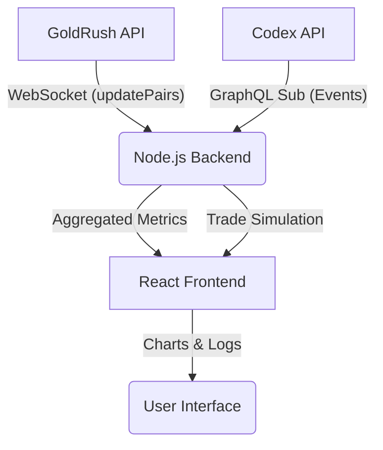

# ⚡️ GoldRush vs Codex: Real-Time Data Benchmark

A high-performance benchmark tool comparing **GoldRush Streaming API** against **Codex GraphQL Subscriptions** for live trading data. This project measures latency, throughput, and "Time to First Data" (TTFD) to determine the fastest data source for algorithmic trading on **Base** and **Solana**.

  

## 🎯 Objective
To provide an **"apples-to-apples" comparison** of live market data streams by running identical listeners on both providers and clocking their performance in real-time.

**Key Metrics Tracked:**
*   **Time to First Data (TTFD):** How fast does the stream deliver the first packet after connection?
*   **Average Latency:** The time difference between the *Block Timestamp* and *Packet Receive Time*.
*   **Events per Interval:** Density of data (candles/trades) received per 5-minute block.
*   **Jitter (Stability):** Variance in latency (P95 vs P50).

## 📊 Features
*   **Dual-Stream Architecture:** Simultaneous WebSocket connections to GoldRush (`updatePairs`) and Codex (`onBarsUpdated`, `onEventsCreated`).
*   **Live Latency Charts:** 60-minute history of average latency and event density.
*   **Heads-Up Display (HUD):** Real-time stats for P50, P95, and Jitter.
*   **Multi-Chain Support:** Dynamically switches between **Base** (Virtual Protocol) and **Solana** (Bonk) based on configuration.
*   **Zero-Lag Visualization:** filtering logic prevents "flatlines" when streams are idle.

## 🏗️ Architecture



**Backend (`/backend`)**:
*   Node.js + `ws` + `graphql-ws`
*   Calculates rolling stats (P50, P95) and throughput (Hz).
*   Manages "Stopwatch" logic for TTFD measurement.

**Frontend (`/frontend`)**:
*   React + Vite
*   `Recharts` for Metric History.
*   `Lightweight Charts` for Price Candles.
*   Real-time "Terminal" logs for debugging.

## 🚀 Quick Start

### Prerequisites
*   Node.js 18+
*   **GoldRush API Key** ([Sign up](https://goldrush.dev))
*   **Codex API Key** ([Sign up](https://codex.io))

### 1. Installation

```bash
git clone https://github.com/zeeshan8281/goldrush-vs-codex-tp.git
cd goldrush-vs-codex-tp

# Install Backend
cd backend && npm install

# Install Frontend
cd ../frontend && npm install
```

### 2. Configuration (`backend/.env`)

Create a `.env` file in the `backend` directory:

```env
COVALENT_API_KEY=your_goldrush_key
CODEX_API_KEY=your_codex_key

# Default Token (Virtual Protocol on Base)
CURRENT_CHAIN=BASE_MAINNET
PAIR_ADDRESS=0x9c087Eb773291e50CF6c6a90ef0F4500e349B903
CODEX_NETWORK_ID=8453
```

### 3. Running benchmark

**Terminal 1 (Backend):**
```bash
cd backend
node index.js
```

**Terminal 2 (Frontend):**
```bash
cd frontend
npm run dev
```

Open **http://localhost:5173** to view the dashboard.

## 📈 Performance Findings (Current)

| Metric | GoldRush (Streaming) | Codex (GraphQL) |
| :--- | :--- | :--- |
| **TTFD** | **~200ms - 2s** (Snapshot) | ~17s - 60s (Waits for Event) |
| **Latency** | **< 2s** | ~2s - 10s |
| **Type** | Push (WebSocket) | Push (GraphQL Sub) |

*Note: GoldRush typically wins on TTFD because it sends an initial state snapshot immediately upon connection, whereas Codex often waits for the next market event.*

## 🤝 Contributing
PRs are welcome! Please ensure you:
1.  Run `node index.js` to verify backend streams.
2.  Check the "Stats" page for any rendering errors.

## 📝 License
MIT License. Built for the GoldRush community.
